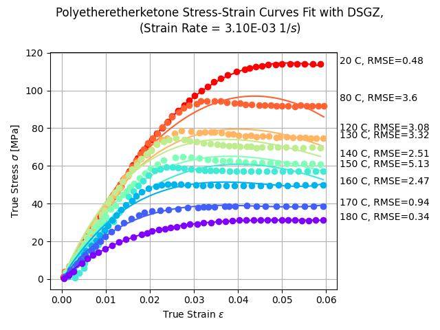
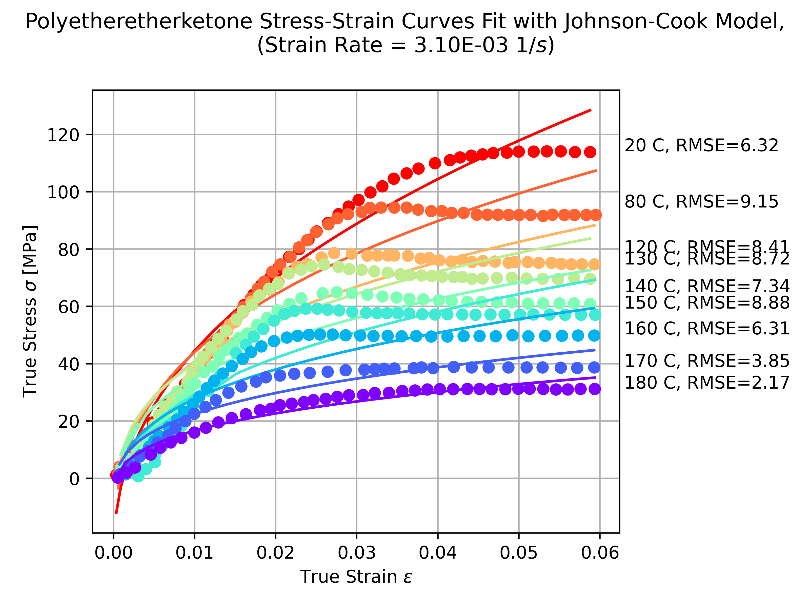
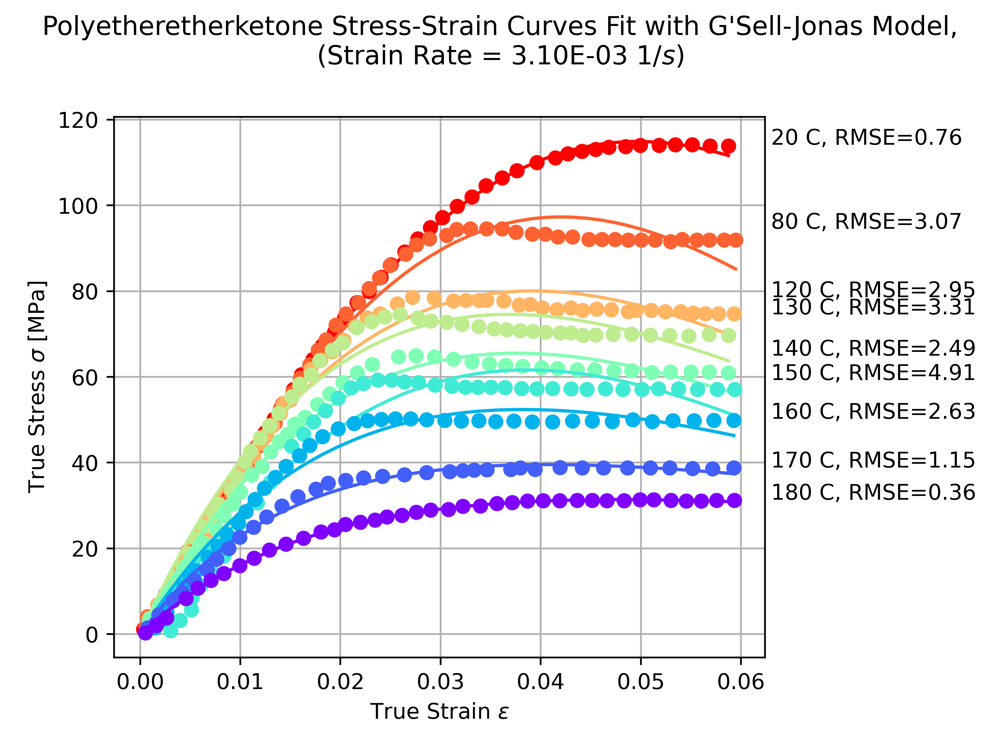

# ME 510: Continuum Mechanics Final Project
## Modeling Polyetheretherketone (PEEK) with the DSGZ Model
Madeline Hunt

05 Dec 2024

### References
1. Experimental data from Drozdov, et. al. 2021
2. DSGZ Model from Duan et. al., 2001
3. Johnson-Cook Model from Johnson and Cook, 1983
4. G'Sell-Jonas Model from G'Sell and Jonas, 1979

### Results

